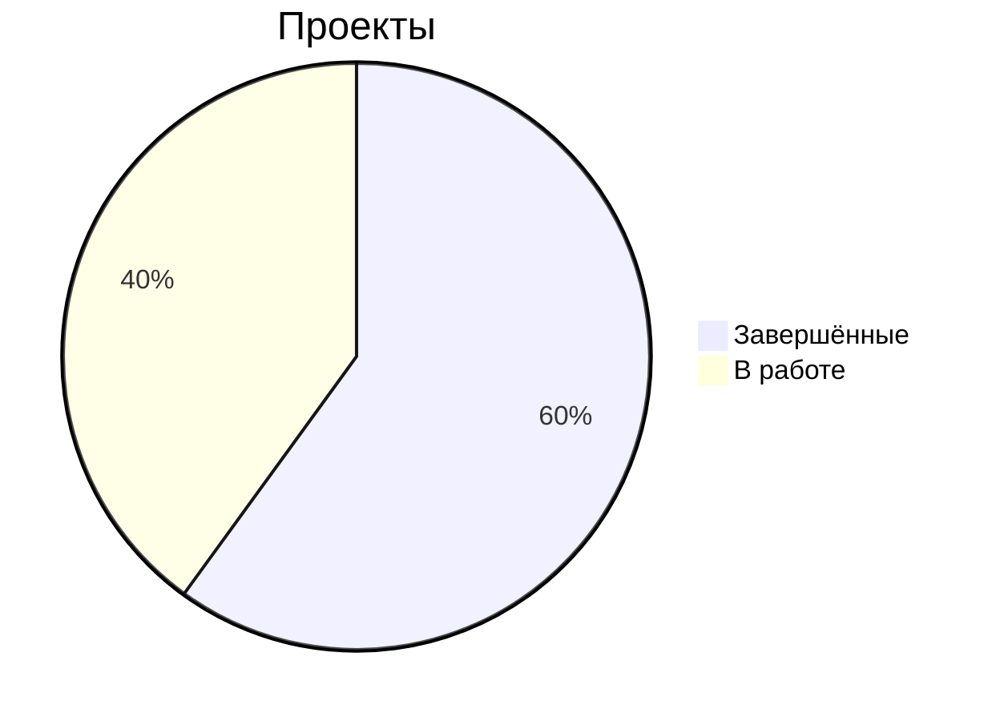

#  Моя база знаний

# 🏠 Главная страница

## 📅 Задачи
- [x] Обновить документацию  
- [ ] Проверить баги  

> [!WARNING]  
> До 20 июня сервер на обслуживании!

[Контакты](/Contacts)

---

## 🔍 Быстрый доступ
- [Частые вопросы (FAQ)](#faq)
- [характеристики](#характеристики)
- [Важные инструкции](#инструкции)

---

## ❓ FAQ {#faq}
### Как получить доступ к системе?
1. Перейди по [ссылке](https://example.com)
2. Введи логин: `твой_логин`
3. Пароль: `твой_пароль`

### Куда загружать отчеты?
Все отчеты загружаются в [эту папку](https://drive.google.com/...).

---

## 📋 Инструкции {#инструкции}
### Наша папка на сетевом диске
1. Открой Outlook
2. Нажми "Файл" → "Добавить учетную запись"
3. Введи корпоративную почту

### Наш адрес (шаблон сообщения для клиента)
Югорский проезд 2с10
Заезд на территорию со стороны Югорского проезда.
Через ворота прямо до упора, затем направо (ориентир - желтая дверь)

1. Скачай [бланк заявления](...)
2. Заполни его
3. Отправь на почту hr@company.com

---

## Таблица технических характеристик зуботехнических микромоторов Strong {характеристики}
### Таблица технических характеристик зуботехнических микромоторов Strong

| **Параметр**                     | **Strong 210/105L**       | **Strong 210/120**       | **Strong 210/107II**     | **Strong 211/H400RU**    | **Strong 211/H400RU Black Edition** | **Strong One/H350RU**    | **Strong Brillian B100/H100** | **Strong Brillian B100/H120** |
|----------------------------------|---------------------------|--------------------------|--------------------------|--------------------------|-------------------------------------|--------------------------|-------------------------------|-------------------------------|
| **Габариты блока (Д×Ш×В, мм)**  | 130×135×85               | 130×135×85              | 130×135×85              | 138×130×83              | 138×130×83                         | 107×152×72              | 116×103.7×74                 | 116×103.7×74                 |
| **Диаметр наконечника (мм)**     | 29                       | 28                      | 27                      | 28                      | 28                                  | 29                      | 19.8                         | 28                          |
| **Длина наконечника (мм)**       | 258                      | 129                     | 146                     | 158                     | 158                                 | 153                     | 118.1                        | 129.4                       |
| **Масса блока (г)**             | 1300                     | 1300                    | 1300                    | 1300                    | 1300                                | 1050                    | 430                          | 430                         |
| **Масса наконечника (г)**       | 196                      | 170                     | 196                     | 233                     | 233                                 | 184                     | 143                          | 162                         |
| **Тип двигателя**               | Щеточный                 | Щеточный                | Щеточный                | Щеточный                | Щеточный                           | Щеточный                | Щеточный                     | Щеточный                    |
| **Крутящий момент (Н·см)**      | 2.8                      | 2.0                     | 3.0                     | 4.0                     | 4.0                                 | 3.0                     | 3.0                          | 3.0                         |
| **Напряжение (В)**              | 220                      | 220                     | 220                     | 220                     | 220                                 | 220                     | 220                          | 220                         |
| **Частота вращения (об/мин)**   | 0–35 000                 | 0–30 000                | 0–35 000                | 0–37 000                | 0–37 000                           | 0–40 000                | 0–30 000                     | 0–30 000                    |
| **Потребляемая мощность (Вт)**  | 4.5–64                   | 4.5–64                  | 4.5–64                  | 4.5–64                  | 4.5–64                             | 4.5–64                  | 1–50 (64)                    | 1–50 (64)                   |
| **Уровень шума (дБ)**           | ≤84                      | ≤84                     | ≤84                     | ≤84                     | ≤84                                | ≤84                     | ≤84                          | ≤84                         |
| **Класс защиты (IP)**           | IP20                     | IP20                    | IP20                    | IP20                    | IP20                               | IP20                    | IP20                         | IP20                        |
| **Предохранитель**              | 2A (быстродействующий)   | 2A (быстродействующий)  | 2A (быстродействующий)  | N2AL (быстродействующий)| N2AL (быстродействующий)           | 2A (быстродействующий)  | 3.15A (с задержкой)          | 3.15A (с задержкой)         |
| **ЖК-дисплей**                  | Нет                      | Нет                     | Нет                     | Нет                     | Нет                                | Нет                     | Да (2")                      | Да (2")                     |

### Примечания:
1. Все модели работают при температуре от +10°C до +35°C и влажности 20–80%.
2. Диаметр хвостовика фрезы для всех моделей — 2.35 мм.
3. Гарантийный срок — 12 месяцев, срок службы — 2 года.
4. Класс риска медицинского изделия — 2a

---

## 🔗 Полезные ссылки
- [Корпоративный портал](https://portal.company.com)
- [Google Диск с шаблонами](https://drive.google.com/...)
- [Календарь встреч](https://calendar.google.com/...)

---

Последнее обновление: 11.06.2024_
